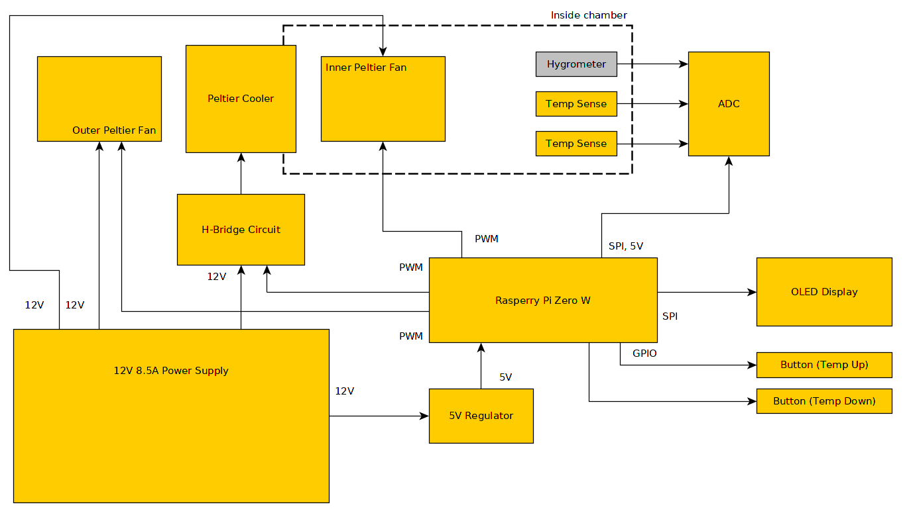

# chamber
Kitchen countertop thermal chamber used for longer duration culinary
processes that require precise temperature control such as sourdough 
starter care, pickling, and others.

This project was accepted as a demo presentation at the 2019 Hackaday
Superconference. The presentation can be found here: https://docs.google.com/presentation/d/1pnsGfKx_trj58ampCZZywA2gX1rxPGUsQPXvuTJ43v0/edit?usp=sharing

### Roadmap
 - Switch controlled interior lights
 - Custom PCB to reduce cost and clean up look
 - Mechanical design improvements: hinged door, stackable, insulation

### Hardware Block Diagram

### Software Requirements
 - https://github.com/hallard/ArduiPi_OLED 
 - https://github.com/joan2937/pigpio

##### Acknowledgements
MCP3008 functions were borrowed from the well documented site here: 
 - http://www.hertaville.com/interfacing-an-spi-adc-mcp3008-chip-to-the-raspberry-pi-using-c.html
