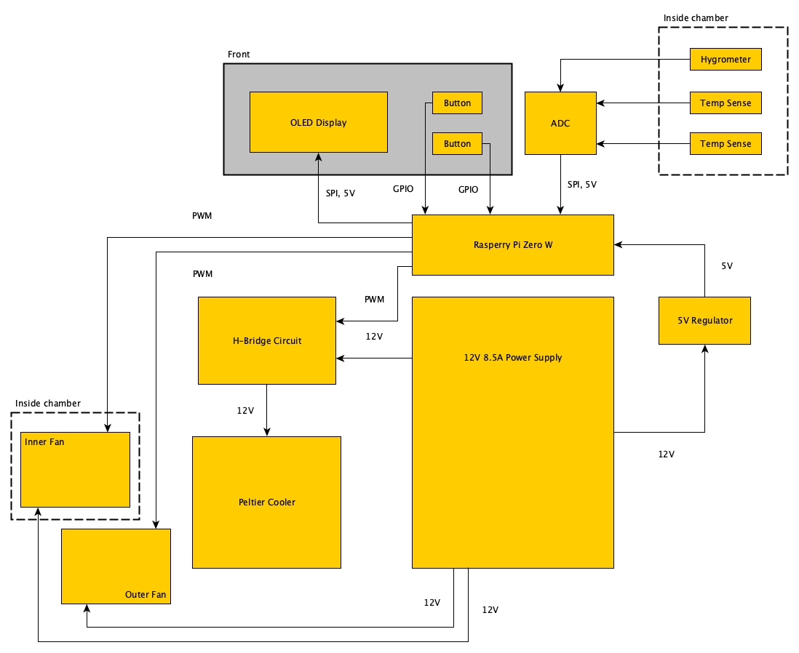

# chamber
Kitchen countertop thermal chamber used for longer duration culinary
processes that require precise temperature control such as sourdough 
starter care, pickling, and others.

### Hardware Block Diagram

### Software Requirements
 - https://github.com/hallard/ArduiPi_OLED 

##### Acknowledgements
MCP3008, PWM, and GPIO functions were borrowed from the well documented site here: 
 - http://www.hertaville.com/interfacing-an-spi-adc-mcp3008-chip-to-the-raspberry-pi-using-c.html
 - http://www.hertaville.com/rpipwm.html
 - http://www.hertaville.com/introduction-to-accessing-the-raspberry-pis-gpio-in-c.html
